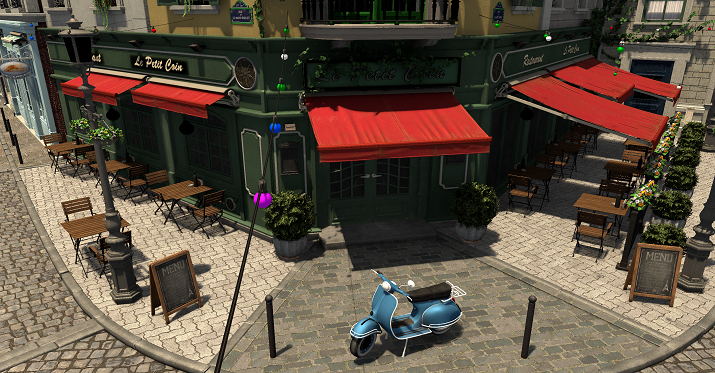
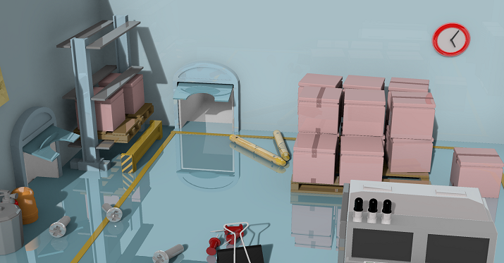
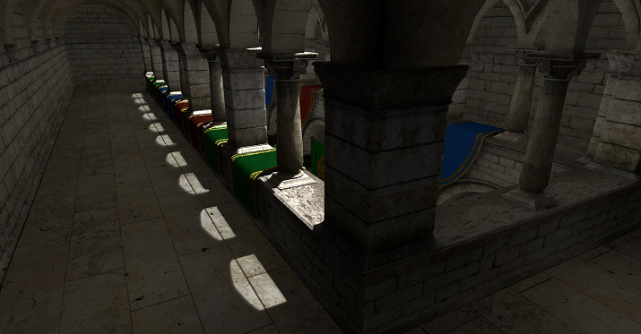

# A Hybrid Framework for Real-Time Ray Tracing and Rasterization
This project was developed as the final project in my Bachelors degree at the Technical University of Denmark.

The project explores the combination of rasterization and ray tracing, also referred to as hybrid rendering.

# Features
- glTF 2.0 scene loading
- Render graph 
- User Interface with Dear ImGUI

# Rendering effects implemented
- Ray traced shadows
- Ray traced ambient occlusion
- Ray traced mirror reflections
- Rasterized shadows with shadow mapping
- Rasterized ambient occlusion using the Alchemy SSAO algorithm
- Rasterized reflections using world space ray marching
- Denoising implementation based on NVIDIA's Spatiotemporal Variance-Guided Filtering (SVGF)

# Example renders

# Libraries and Dependencies
- [Vulkan](https://www.khronos.org/vulkan/)
- [Dear ImGui](https://github.com/ocornut/imgui)
- [stb](https://github.com/nothings/stb)
- [cgltf](https://github.com/jkuhlmann/cgltf)
- [OpenGL Mathematics (GLM)](https://github.com/g-truc/glm)
- [Vulkan Memory Allocator](https://github.com/GPUOpen-LibrariesAndSDKs/VulkanMemoryAllocator)
- [Volk](https://github.com/zeux/volk)